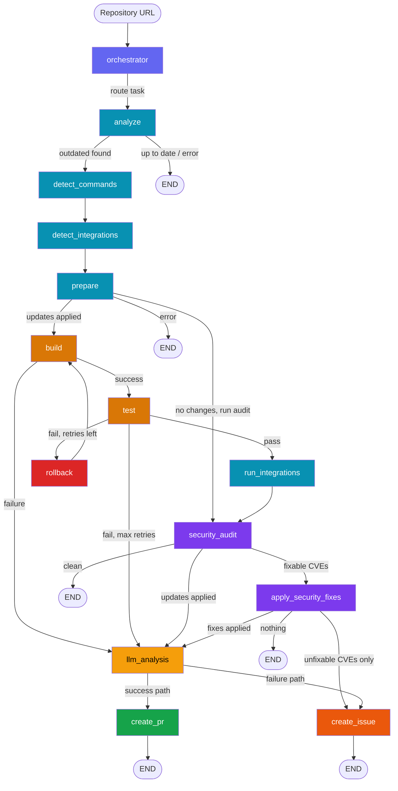

<p align="center">
  <h1 align="center">pdvd-aiops</h1>
  <p align="center">
    <strong>Your dependencies are outdated. Your CVEs are piling up. You're three major versions behind on half your stack.</strong>
    <br />
    This fixes all of that — automatically.
  </p>
</p>

<p align="center">
  <a href="#quick-start">Quick Start</a> &bull;
  <a href="#how-it-works">How It Works</a> &bull;
  <a href="#intelligence-layer">Intelligence Layer</a> &bull;
  <a href="#supported-ecosystems">Ecosystems</a> &bull;
  <a href="#api">API</a>
</p>

---

**pdvd-aiops** is a multi-agent pipeline that takes a GitHub repo URL, updates every outdated dependency, builds it, tests it, rolls back what breaks, patches CVEs, and opens a PR — with an LLM-written summary that tells you exactly what changed and what to watch out for.

One command. Zero manual work. Typically under $0.01 per run.

```bash
python -m src.cli.main your-org/your-repo
```

That's it. Come back to a PR like this:

> **chore(deps): update 14 dependencies**
>
> This PR updates 11 direct and 3 transitive dependencies (2 major, 5 minor, 7 patch). The `go-git` v6 bump removes the deprecated `PlainClone` API — use `Clone()` instead. Security posture improves: the `x/net` HTTP/2 fix resolves GO-2024-2687. All tests pass.
>
> ### Breaking Change Risk Assessment
> **go-git v6.0.0** drops the `PlainClone` function. Migrate to `Clone()` with a `CloneOptions` struct. Risk: HIGH — this is a widely-used function...
>
> ### Prioritized Recommendations
> **Fix immediately**: `golang.org/x/net` (GO-2024-2687) — the vulnerable HTTP/2 handler is called from your `server.go`...

---

## What It Does

| Step | What happens | Is it smart? |
|------|-------------|-------------|
| Clone & detect | Identifies your ecosystem from lock files — pip, npm, cargo, go, poetry, pnpm, yarn | Deterministic |
| Check outdated | Runs `npm outdated`, `pip list --outdated`, `go list -u -m -json all`, etc. | Deterministic |
| Find build commands | Parses your CI config first. No CI? Reads `package.json` scripts. Still nothing? Asks the LLM once | Hybrid |
| Apply updates | Edits your dependency file (or runs `cargo update` / `go get -u`) | Deterministic |
| Build & test | Runs your actual build and test commands | Deterministic |
| Rollback loop | Test failed? Identifies the culprit (heuristic first, LLM if ambiguous), rolls it back, retries — up to 3x | Hybrid |
| Run integrations | Executes every linter/formatter configured in your repo (ESLint, Ruff, Prettier, Black...) | Deterministic |
| Security audit | Runs `pip-audit` / `npm audit` / `cargo audit` / `govulncheck` + Trivy, OSV-scanner, Semgrep... | Deterministic |
| Patch CVEs | Applies fixes for CVEs that have a fix version. Adds TODO comments for unfixable ones | Deterministic |
| LLM analysis | Changelog risk assessment, security triage, failure diagnosis, maintainer summary | LLM (0-4 calls) |
| Open PR or Issue | Creates a GitHub PR with full details — or an Issue if things broke | Deterministic |

**Total LLM cost per run**: $0.001 – $0.01 depending on what fires. Most of the pipeline is free.

---

## Quick Start

### Prerequisites

- Python 3.9+
- Docker (for the GitHub MCP server)
- A GitHub Personal Access Token with `repo` + `workflow` scopes
- An API key for any supported LLM provider

### Install

```bash
git clone https://github.com/codeWithUtkarsh/pdvd-aiops.git
cd pdvd-aiops
pip install -e .
```

### Configure

```bash
export GITHUB_PERSONAL_ACCESS_TOKEN='ghp_...'

# Pick your LLM provider
export LLM_PROVIDER=groq           # anthropic | gemini | openai | groq | huggingface | ollama
export GROQ_API_KEY='gsk_...'      # or ANTHROPIC_API_KEY, OPENAI_API_KEY, GOOGLE_API_KEY, HF_TOKEN
```

Or drop these in a `.env` file. The pipeline reads it automatically.

### Run

```bash
# Single repo
python -m src.cli.main your-org/your-repo

# Full URL works too
python -m src.cli.main https://github.com/your-org/your-repo
```

### Run across an org (batch mode)

```python
from src.pipeline.graph import run_pipeline_batch

result = run_pipeline_batch([
    "your-org/repo-a",
    "your-org/repo-b",
    "your-org/repo-c",
])

print(result["multi_repo_summary"])
# → "5 of your 12 repos depend on vulnerable golang.org/x/net.
#    Updating repo-a and repo-c would eliminate 28 advisories."
```

### API Server

```bash
python -m src.api.startup
# → http://localhost:8000/docs
```

```bash
# Submit a repo
curl -X POST http://localhost:8000/analyze \
  -H 'Content-Type: application/json' \
  -d '{"repo_url": "your-org/your-repo"}'
# → {"job_id": "abc123"}

# Check status
curl http://localhost:8000/jobs/abc123
```

---

## How It Works



**Color legend**: <span style="color:#6366f1">Orchestrator</span> | <span style="color:#0891b2">Deterministic</span> | <span style="color:#d97706">Build/Test</span> | <span style="color:#dc2626">Rollback</span> | <span style="color:#7c3aed">Security</span> | <span style="color:#f59e0b">LLM Intelligence</span> | <span style="color:#16a34a">PR</span> | <span style="color:#ea580c">Issue</span>

---

## Intelligence Layer

This is where the LLM does work that deterministic code *can't*. Each analyzer fires only when its preconditions are met — no wasted calls.

### 1. Changelog Risk Assessment

> *"go-git v6.0.0 drops the PlainClone API. Migrate to Clone() with CloneOptions. Risk: HIGH."*

When a dependency jumps a major version, the LLM summarizes what broke and what to migrate. The PR body gets a **Breaking Change Risk Assessment** section instead of just "major update."

**Fires when**: Any applied update is a major version bump.

### 2. Security Fix Prioritization

> *"Fix immediately: golang.org/x/net (GO-2024-2687) — the vulnerable HTTP/2 handler is called from your server.go. Monitor: 4 circl advisories are unreachable from your code."*

Your audit found 190 advisories. This tells you which ones matter and why — grouped into **Fix immediately**, **Fix soon**, and **Monitor**.

**Fires when**: Security audit has findings.

### 3. Test Failure Diagnosis

> *"Package express v5.0 renamed app.delete() to app.route().delete(). Update line 47 of routes/users.js."*

When the build or tests fail after updates (and rollback is exhausted), the LLM reads the full error output + the diff of what changed and pinpoints the exact cause — not just "tests failed," but *why* and *how to fix it*.

**Fires when**: Build or test failed (after max retries).

### 4. Maintainer PR Summary

> *"This PR updates 11 direct and 3 transitive dependencies. The x/net patch fixes a known HTTP/2 DoS. No breaking API changes. Security posture improves — 4 circl advisories remain but are unreachable."*

A decision-ready summary at the top of every PR. Not a list of packages — a narrative that tells a maintainer whether to merge.

**Fires when**: Any updates or security fixes were applied.

### 5. Multi-Repo Intelligence

> *"5 of your 12 repos depend on vulnerable golang.org/x/net. Updating pdvd-backend and pdvd-frontend would eliminate 28 advisories. pdvd-auth can't be updated — it pins v0.12 for compatibility."*

After running a batch across your org, one LLM call synthesizes which repos share vulnerabilities, which to update first, and where to focus your time.

**Fires when**: `run_pipeline_batch()` completes across multiple repos.

---

## Supported Ecosystems

| Ecosystem | Package Manager | Outdated Check | Update Strategy | Security Audit | Release URLs |
|-----------|----------------|----------------|-----------------|----------------|-------------|
| Python | pip | `pip list --outdated` | Edit requirements.txt / pyproject.toml / setup.cfg | `pip-audit` | PyPI |
| Python | poetry | `poetry show --outdated` | Edit pyproject.toml | `pip-audit` | PyPI |
| Python | pipenv | `pipenv update --outdated` | Edit Pipfile | `pip-audit` | PyPI |
| Node.js | npm | `npm outdated --json` | Edit package.json | `npm audit` | npmjs.com |
| Node.js | yarn | `yarn outdated` | Edit package.json | — | npmjs.com |
| Node.js | pnpm | `pnpm outdated --format json` | Edit package.json | — | npmjs.com |
| Rust | cargo | `cargo outdated` | `cargo update` | `cargo audit` | crates.io |
| Go | go-mod | `go list -u -m -json all` | `go get -u ./...` | `govulncheck` | pkg.go.dev |

**Adding a new ecosystem** = one file in `src/ecosystems/` with a `@register` decorator. The plugin declares how to detect, parse, update, rollback, and audit — the pipeline handles the rest.

---

## Integration Tools

The pipeline auto-detects tools configured in your repo (by config file presence) and runs them:

| Category | Tools |
|----------|-------|
| **Linters** | ESLint, Ruff, golangci-lint, Clippy, RuboCop, PHPCS |
| **Formatters** | Prettier, Black, gofmt |
| **Security** | Trivy, OSV-scanner, Semgrep, Bandit, Hadolint, Checkov, tfsec |
| **Dependency** | Renovate, pre-commit, commitlint |

Tools that aren't installed get auto-installed before running and cleaned up after.

---

## LLM Providers

All LLM calls go through a single factory (`src/config/llm.py`). Switch providers with one env var:

| Provider | `LLM_PROVIDER` | Default Model | API Key Env Var |
|----------|----------------|---------------|-----------------|
| Anthropic | `anthropic` | claude-sonnet-4-5-20250929 | `ANTHROPIC_API_KEY` |
| Google Gemini | `gemini` | gemini-2.0-flash | `GOOGLE_API_KEY` |
| OpenAI | `openai` | gpt-4o-mini | `OPENAI_API_KEY` |
| Groq | `groq` | llama-3.3-70b-versatile | `GROQ_API_KEY` |
| HuggingFace | `huggingface` | Llama-3.3-70B-Instruct | `HF_TOKEN` |
| Ollama | `ollama` | llama3 | — (local) |

The pipeline doesn't care which model you use. Every LLM call has a deterministic fallback if the call fails.

---

## What the PR Looks Like

A PR created by pdvd-aiops includes:

- **Maintainer Summary** — LLM-written, decision-ready narrative
- **Updated Dependencies Table** — package, version change, update type, release link
- **Breaking Change Risk Assessment** — for major bumps, what broke and how to migrate
- **Security Fixes Applied** — CVEs patched, with links
- **Unfixable CVEs** — with TODO comments added to your dependency file
- **Build & Test Logs** — collapsible, full output
- **Integration Checks** — linter/formatter results
- **Security Audit** — prioritized recommendations + scanner summary
- **Detected Tools** — tools configured but not installed on the runner

---

## What the Issue Looks Like

When builds fail after exhausting retries:

- **Root Cause Analysis** — LLM diagnosis of exactly what broke and how to fix it
- **Updates Attempted** — what was changed
- **Error Logs** — full build/test output
- **Rollback History** — what was tried and rolled back

When unfixable CVEs are found:

- **CVE Details Table** — with severity, links, fix status
- **Affected Packages** — grouped by package
- **Ecosystem-Specific Remediation** — `overrides` for npm, `replace` for Go, `[patch]` for Cargo...
- **Living tracker** — the same issue gets updated on each scan (find-or-update pattern)

---

## Project Structure

```
src/
  intelligence/        # LLM analysis layer (5 analyzers)
    base.py            # Analyzer protocol + shared invoke_llm()
    changelog.py       # Breaking change risk assessment
    security_prioritizer.py  # CVE triage and prioritization
    failure_diagnosis.py     # Build/test failure root cause
    pr_summary.py      # Maintainer-focused PR narrative
    multi_repo.py      # Cross-repo intelligence synthesis
  pipeline/
    state.py           # PipelineState TypedDict — single source of truth
    edges.py           # Conditional routing (14 edge functions)
    graph.py           # LangGraph wiring + run_pipeline() + run_pipeline_batch()
    nodes/             # 14 nodes (one file each)
  ecosystems/          # Plugin-per-ecosystem (pip, npm, cargo, go, poetry, pipenv, yarn, pnpm)
    __init__.py        # EcosystemPlugin base class + registry
  integrations/
    registry.py        # DevOps tool auto-detection + execution
    definitions/       # Tool configs (ESLint, Trivy, Prettier, ...)
  tools/
    github_tools.py    # PR/Issue creation, formatting, find-or-update
  config/
    llm.py             # Multi-provider LLM factory
  callbacks/
    cost_tracker.py    # Per-phase token + cost tracking
  api/
    server.py          # FastAPI endpoints
  cli/
    main.py            # CLI entry point
```

---

## Architecture Principles

| Principle | How it's applied |
|-----------|-----------------|
| **Single Responsibility** | Each pipeline node does one thing. Each analyzer handles one analysis type |
| **Open/Closed** | New ecosystems = new file + `@register`. New analyzers = new class + add to registry list. Zero modification to existing code |
| **Dependency Inversion** | Pipeline nodes depend on the `Analyzer` protocol, not concrete classes. `get_llm()` abstracts the provider |
| **Strategy Pattern** | File-based vs command-based updates/rollbacks per ecosystem plugin |
| **Guard Clause** | Every analyzer's `should_run()` prevents wasted LLM calls — patch-only updates skip changelog analysis |
| **Graceful Degradation** | Every LLM call has a fallback. If the model is down, you still get a PR — just without the narrative |

---

## Security

- **No shell injection**: All subprocess calls use `shell=False` with validated commands
- **Repo ownership verified**: Checks push access before touching anything
- **Audit tools auto-cleanup**: Installed for the scan, removed after
- **Unfixable CVEs tracked**: Persistent issue per repo, updated incrementally
- **No secrets in PRs**: Dependency files only — no `.env` or credentials

---

## Cost Breakdown

| Component | LLM Calls | Tokens | Cost |
|-----------|-----------|--------|------|
| Orchestrator | 0 (single route) | 0 | $0 |
| Detect commands | 0-1 (only if no CI config) | 0-300 | $0-0.001 |
| Rollback analysis | 0-1 (only if heuristics fail) | 0-200 | $0-0.001 |
| Changelog risk | 0-1 (only if major bumps) | 0-500 | $0-0.002 |
| Security triage | 0-1 (only if findings exist) | 0-600 | $0-0.002 |
| Failure diagnosis | 0-1 (only on failure) | 0-500 | $0-0.002 |
| Maintainer summary | 0-1 (if updates applied) | 0-400 | $0-0.001 |
| **Typical total** | **1-3** | **~800** | **~$0.003** |

Everything else — ecosystem detection, outdated checks, builds, tests, security audits, git operations — is deterministic and free.

---

## License

MIT
