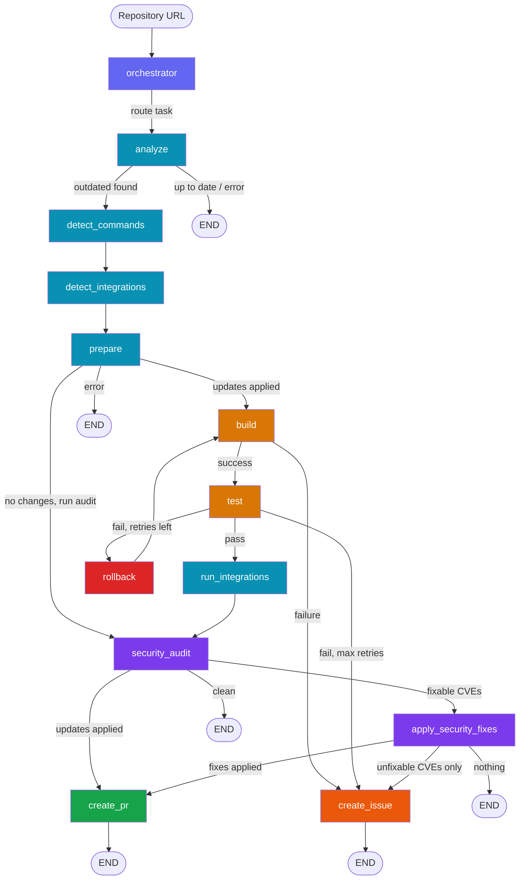

# pdvd-aiops

Automated dependency updater powered by LangGraph. Clones a repo, detects the ecosystem, updates dependencies, builds, tests, rolls back failures, runs security audits, and creates PRs or Issues — all in a single pipeline invocation.

## Pipeline



## How It Works

| Phase | What happens | LLM tokens |
|-------|-------------|------------|
| **Orchestrator** | Routes to the correct pipeline (currently: dependency_update) | 0 (single route) |
| **Analyze** | Clone repo, detect ecosystem, check outdated packages | 0 |
| **Detect Commands** | Parse CI config for build/test commands, fallback to LLM | 0-300 |
| **Detect Integrations** | Scan for DevOps tools (ESLint, Trivy, Renovate, etc.) | 0 |
| **Prepare** | Apply updates via ecosystem plugin (file edit or command) | 0 |
| **Build / Test** | Run build and test commands, capture output | 0 |
| **Rollback** | Identify failing package (heuristic + LLM fallback), rollback, retry up to 3x | 0-200 |
| **Run Integrations** | Execute detected linters, formatters, dependency managers | 0 |
| **Security Audit** | Ecosystem audit (pip-audit, npm audit, cargo audit, govulncheck) + universal scanners | 0 |
| **Apply Security Fixes** | Patch fixable CVEs, track unfixable ones | 0 |
| **Create PR** | Push changes, create/update GitHub PR with detailed body | 0-300 (AI summary) |
| **Create Issue** | Build/test failure report OR security CVE tracking issue (find-or-update) | 0 |

Typical pipeline cost: **~$0.005** per run.

## Supported Ecosystems

| Ecosystem | Plugin | Outdated Check | Update Strategy | Security Audit |
|-----------|--------|---------------|-----------------|----------------|
| **Python/pip** | `pip` | `pip list --outdated` | Edit requirements.txt / pyproject.toml | `pip-audit` |
| **Python/Poetry** | `poetry` | `poetry show --outdated` | Edit pyproject.toml | `pip-audit` |
| **Node.js/npm** | `npm` | `npm outdated --json` | Edit package.json | `npm audit` |
| **Node.js/Yarn** | `yarn` | `yarn outdated` | Edit package.json | - |
| **Node.js/pnpm** | `pnpm` | `pnpm outdated --format json` | Edit package.json | - |
| **Rust/Cargo** | `cargo` | `cargo outdated` | `cargo update` | `cargo audit` |
| **Go** | `go-mod` | `go list -u -m -json all` | `go get -u ./...` | `govulncheck` |

Adding a new ecosystem = one file in `src/ecosystems/` with a `@register` decorator.

## Quick Start

### Prerequisites

- Python 3.9+
- Docker (for GitHub MCP server)
- GitHub Personal Access Token (`repo` + `workflow` scopes)

### Setup

```bash
git clone https://github.com/codeWithUtkarsh/pdvd-aiops.git
cd pdvd-aiops
pip install -e .
```

Set environment variables (or create `.env`):

```bash
export ANTHROPIC_API_KEY='sk-ant-...'
export GITHUB_PERSONAL_ACCESS_TOKEN='ghp_...'
```

### Run

```bash
# CLI
python -m src.agents.orchestrator https://github.com/owner/repo

# Or shorthand
python -m src.agents.orchestrator owner/repo
```

### API Server

```bash
python -m src.api.startup
# → http://localhost:8000/docs
```

## Project Structure

```
src/
  ecosystems/          # Plugin-per-ecosystem (pip, npm, cargo, go, ...)
    __init__.py        # EcosystemPlugin ABC + registry
    pip.py, npm.py, cargo.py, go.py
  pipeline/
    state.py           # PipelineState TypedDict
    edges.py           # Conditional routing functions
    graph.py           # LangGraph wiring + run_pipeline()
    nodes/             # One file per pipeline node
  integrations/
    registry.py        # DevOps tool registry (linters, scanners, ...)
    definitions/       # Tool definitions (ESLint, Trivy, Hadolint, ...)
    mcp_server_manager.py  # Persistent GitHub MCP connection
  tools/
    github_tools.py    # PR/Issue creation, find-or-update logic
  config/
    llm.py             # Multi-provider LLM factory
  callbacks/
    cost_tracker.py    # Per-phase token + cost tracking
  api/
    server.py          # FastAPI endpoints
  utils/
    env.py             # Unified subprocess environment
    subprocess.py      # Safe command execution (shell=False by default)
tests/
  test_unit.py         # 95 unit tests
  test_e2e_pipeline.py # End-to-end pipeline tests
```

## LLM Provider Support

Configure via environment variables:

```bash
LLM_PROVIDER=anthropic     # anthropic | gemini | openai | groq | ollama
LLM_MODEL_NAME=claude-sonnet-4-5-20250929  # or any model for the chosen provider
```

## Security

- All subprocess calls go through `src/utils/subprocess.py` which uses `shell=False` by default and validates commands against dangerous patterns
- Repository ownership is verified before any modifications
- Security audit tools auto-install and auto-cleanup
- Unfixable CVEs create a persistent tracking issue (one per repo, updated incrementally)

## License

MIT
